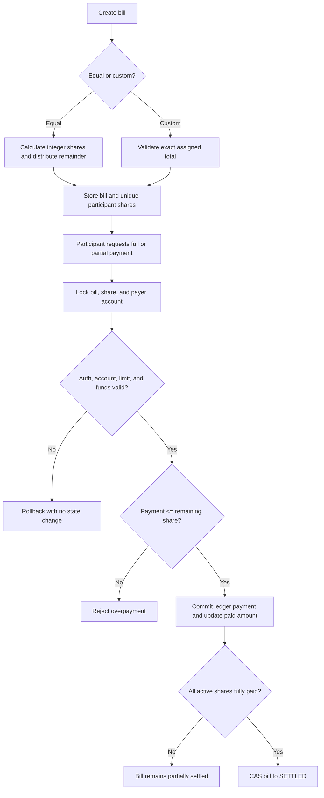
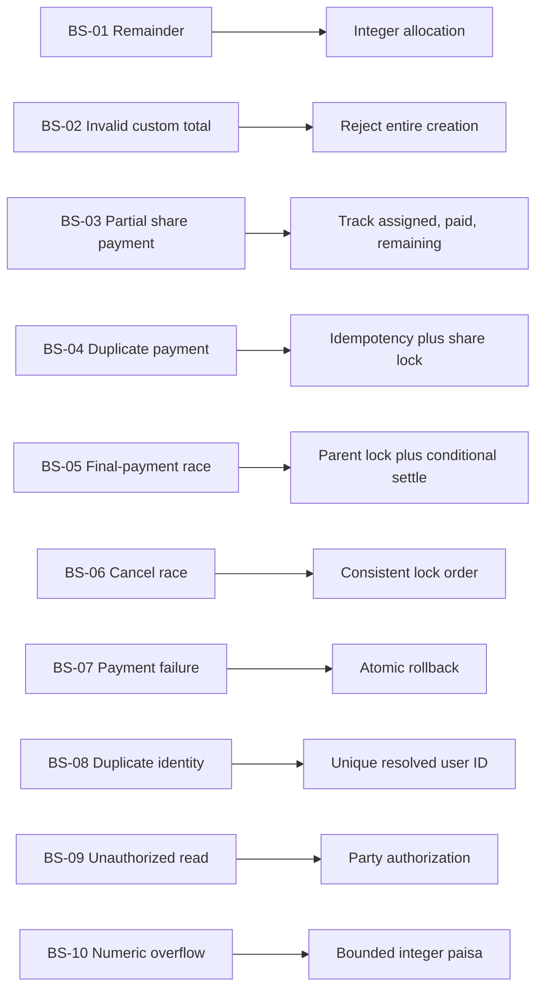
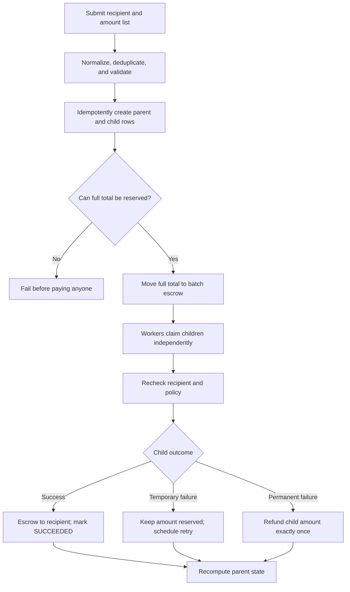
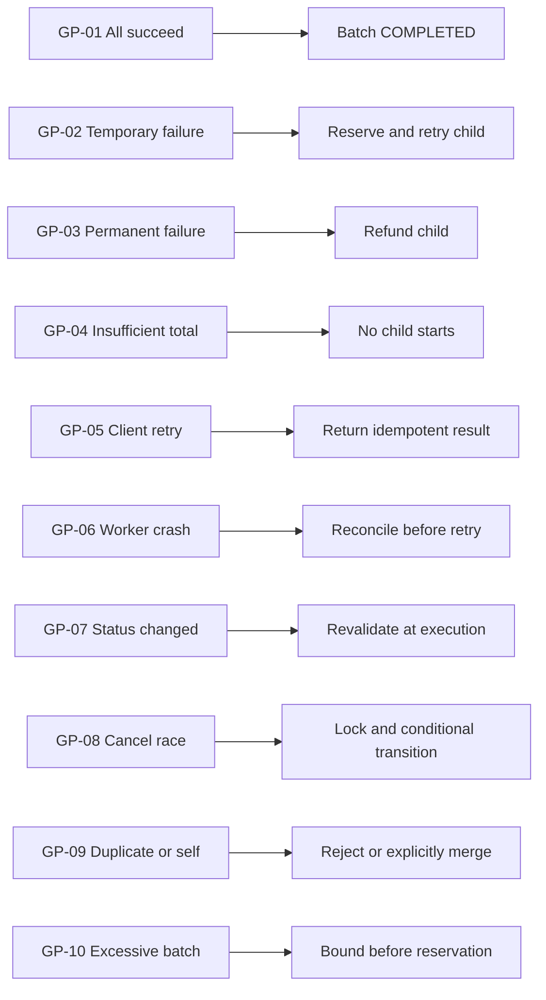
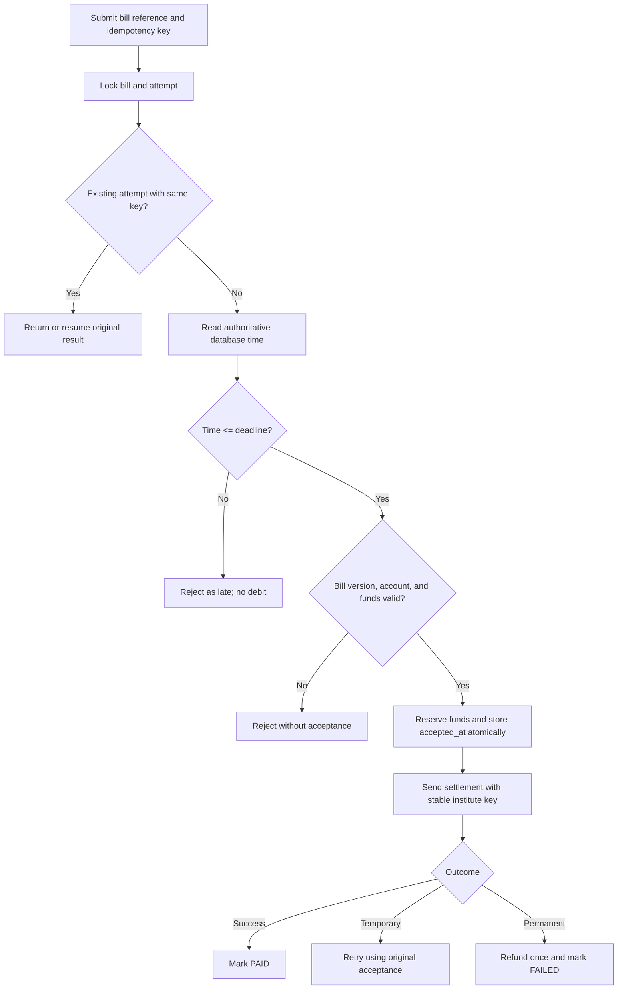
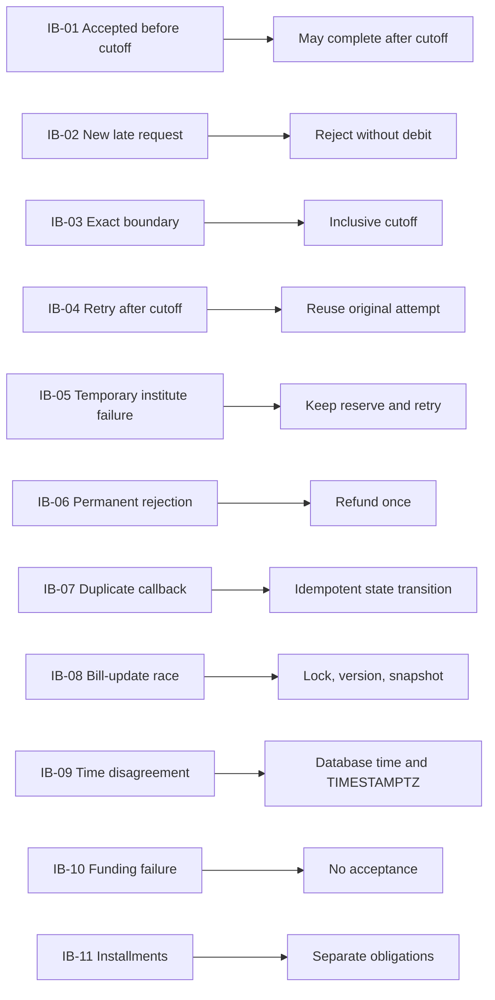
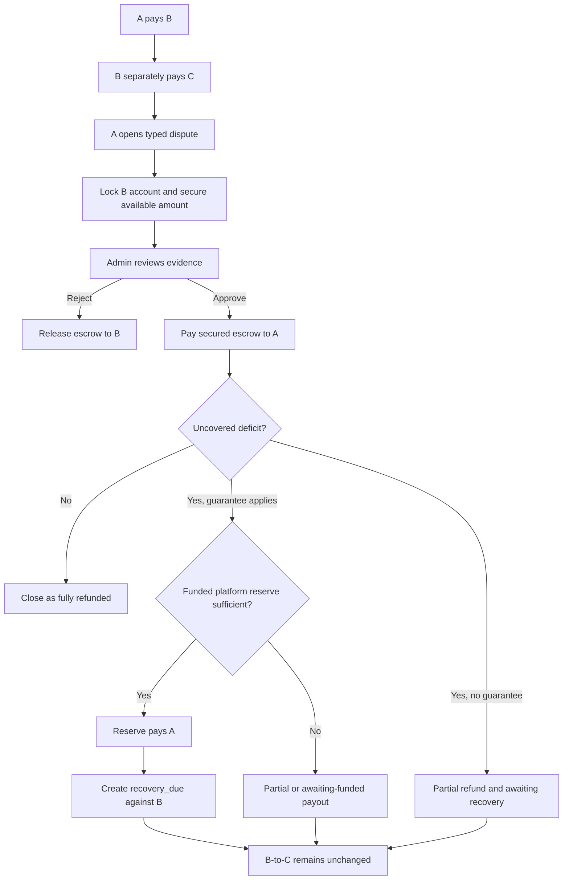
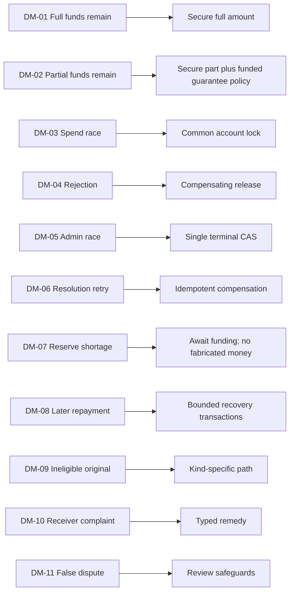
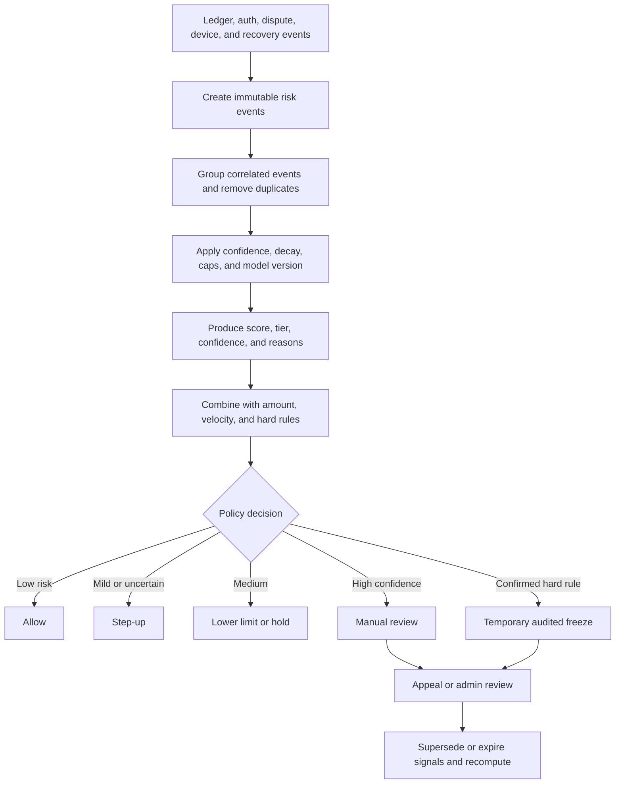
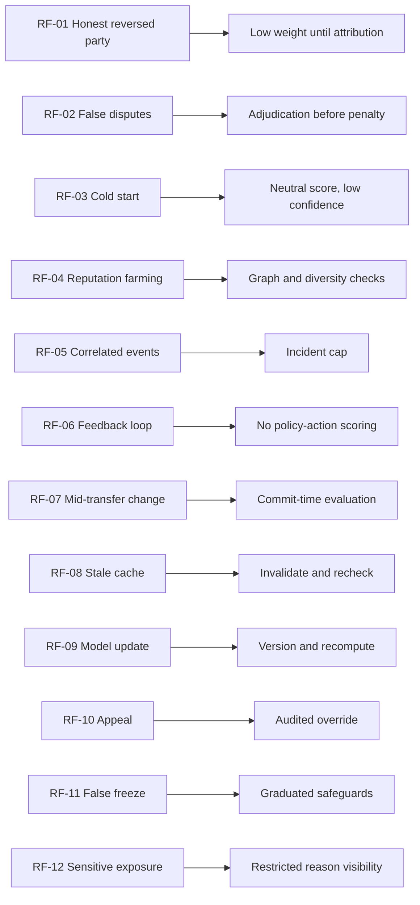

# Extra Features Audit and Design

This document contains only the problem, relevant cases and edge cases, proposed solution, and diagrams. It is a design document; no feature is implemented here.

---

## 1. Bill Split

### Problem

A bill must be divided among several participants using either an equal split or creator-defined custom shares. Participants may pay at different times, but the system must never collect more than the bill total or more than a participant's assigned share. Concurrent payments, retries, and cancellation must not corrupt the result.

### Cases and edge cases

| Case | Problem or edge case | Solution |
|---|---|---|
| BS-01 | Equal division leaves a remainder in paisa, such as 10,000 paisa divided among three people. | Use integer paisa. Give everyone `floor(total / count)`, then distribute the remaining paisa deterministically in participant order. |
| BS-02 | Custom shares add up to less or more than the bill total. | Reject the complete request unless the sum of all assigned shares exactly equals the declared total. |
| BS-03 | A participant pays only part of their assigned share. | Store `assigned_amount` and `paid_amount`; accept a positive payment no greater than `assigned_amount - paid_amount`. Mark the share `PARTIALLY_PAID` until complete. |
| BS-04 | A retry or two devices attempt to pay the same share twice. | Use an actor-scoped idempotency key, lock the share, and conditionally update only when enough unpaid share remains. Commit the ledger movement and share update together. |
| BS-05 | Two participants pay the final outstanding shares at the same time. | Lock the parent bill before the shares. After each payment, conditionally change the bill to `SETTLED` only if every share is fully paid. |
| BS-06 | Payment and bill cancellation happen concurrently. | Use the same lock order for both operations: bill first, then shares. If cancellation wins, payment rejects; if payment wins, apply the documented partially-paid cancellation policy. |
| BS-07 | A payer has insufficient funds, is frozen, exceeds a limit, or fails step-up authentication. | Roll back the whole payment transaction. Leave the share and bill unchanged so payment can be retried safely. |
| BS-08 | The same user appears twice under differently formatted phone numbers. | Normalize identifiers, resolve them to immutable user IDs, and enforce one share per user per bill. |
| BS-09 | An unrelated user tries to view a bill. | Allow bill details only to the creator, listed participants, and authorized admins. Return a non-enumerating not-found response otherwise. |
| BS-10 | Very large values overflow application numeric types. | Accept bounded safe integers in paisa, validate the aggregate, and use database integer types without floating-point arithmetic. |

### Proposed solution

- Store a parent bill with `total_amount`, `split_mode`, and state.
- Store one share per participant with `assigned_amount`, `paid_amount`, and state.
- For equal split, calculate every share on the server using deterministic remainder distribution.
- For custom split, validate that all shares exactly equal the total.
- Store every installment as a separate append-only share-payment record linked to its ledger transaction.
- Enforce `0 <= paid_amount <= assigned_amount` and `sum(assigned_amount) = total_amount`.
- Change the bill to `SETTLED` only when every active share is fully paid.
- Use idempotency, stable lock ordering, and conditional state transitions for all pay/cancel races.

### Solution diagram

### Case diagram

---

## 2. Send Money to a Group

### Problem

One sender needs to pay several recipients in one action. Each recipient payment must succeed or fail independently. A temporary failure must be retryable, a permanent failure must be refundable, and neither client retries nor worker crashes may pay a successful recipient twice.

### Cases and edge cases

| Case | Problem or edge case | Solution |
|---|---|---|
| GP-01 | Every recipient is valid and all payments succeed. | Reserve the total once, create one child transfer per recipient, and finish the parent after all children succeed. |
| GP-02 | Some recipients succeed while another fails temporarily. | Commit successful children and keep only the temporary-failure amount reserved for bounded retry. |
| GP-03 | A recipient is permanently invalid, closed, or prohibited. | Do not retry indefinitely. Refund that child's reserved amount exactly once and mark it permanently failed/refunded. |
| GP-04 | The sender cannot fund the complete group total. | Require an all-or-nothing initial reservation. If it fails, no child payment begins. |
| GP-05 | The client repeats the same group request after a timeout. | Scope an idempotency key to the sender and request hash; return the original parent and child outcomes. |
| GP-06 | A worker crashes after paying a recipient but before updating the child status. | Give each child a stable unique identity and reconcile its ledger transaction before trying to pay again. |
| GP-07 | A recipient becomes frozen or closed after initial validation. | Resolve the immutable recipient ID at creation, then recheck eligibility immediately before payment. Classify the result as temporary or permanent. |
| GP-08 | Cancellation races with a retry worker. | Lock the child and use conditional state transitions. Refund only unprocessed/retryable children; never silently undo successful ones. |
| GP-09 | The list contains the sender or the same recipient multiple times. | Reject self-send. Either reject duplicates or merge them with an explicit preview before confirmation. |
| GP-10 | The group is too large or its aggregate exceeds limits. | Enforce item-count, per-item, aggregate, daily-limit, and risk-policy bounds before reserving funds. |

### Proposed solution

- Create a non-money-moving batch parent that stores sender, total, state, and aggregate counts.
- Create independent child rows containing recipient, amount, status, retry details, and child ledger transaction ID.
- Reserve the complete group total from the sender into sender-owned batch escrow before processing children.
- Pay each successful child from escrow to its recipient in an independent transaction.
- Keep temporary-failure amounts reserved with bounded exponential retry.
- Refund permanent-failure and cancelled amounts from escrow to the sender exactly once.
- Derive the parent result from child states: `PROCESSING`, `PARTIALLY_COMPLETED`, `COMPLETED`, `FAILED`, or `CANCELLED`.

### Solution diagram

### Case diagram

---

## 3. Institute Bill Payment

### Problem

An institute bill has an authoritative deadline. A payment accepted by the server on or before that deadline must remain valid even if internal processing finishes later. A request first received after the deadline must not be accepted. Timeouts and retries must not cause double debit or change an on-time payment into a late one.

### Cases and edge cases

| Case | Problem or edge case | Solution |
|---|---|---|
| IB-01 | The request is accepted just before the deadline but processed afterward. | Record authoritative `accepted_at` and reserve funds atomically before the deadline. Continue processing using that original acceptance. |
| IB-02 | The first request arrives after the deadline. | Compare database time with the bill deadline and reject without reserving or debiting money. |
| IB-03 | The request lands exactly at the deadline. | Define the rule explicitly as `accepted_at <= deadline`; use the same database clock for the comparison. |
| IB-04 | The client times out, then retries after the deadline. | With the same idempotency key and request hash, return or resume the original accepted attempt. A new unknown key is a new late request. |
| IB-05 | The institute endpoint times out or returns a temporary server error. | Keep accepted funds reserved and retry with a stable institute idempotency reference and capped exponential backoff. |
| IB-06 | The institute permanently rejects the bill. | Refund the reserved amount exactly once and mark the attempt terminally failed with a clear reason. |
| IB-07 | The institute sends duplicate or out-of-order callbacks. | Make callbacks idempotent and require expected state/version transitions. Ignore stale events after reconciliation. |
| IB-08 | The bill amount, status, or deadline changes during payment. | Lock the bill, require a version match, and snapshot accepted terms into the payment attempt. |
| IB-09 | Device time, server time zones, or daylight-saving changes disagree. | Store the deadline as an absolute `TIMESTAMPTZ`, retain the institute's named zone for display, and use database time for eligibility. |
| IB-10 | The student has insufficient funds or a frozen account before cutoff. | Do not record successful acceptance until the required amount is atomically reserved. |
| IB-11 | The institute supports installments. | Model installments as separate payable obligations with their own amounts and deadlines; do not ambiguously mark a partially paid full bill as paid. |

### Proposed solution

- Store verified institutes and their settlement identities.
- Store institute-issued bills with student, immutable bill reference, amount, deadline, status, and version.
- Store payment attempts with idempotency key, database-generated `accepted_at`, snapshotted terms, retry state, and ledger links.
- In one database transaction, lock the bill, check `database_time <= deadline`, validate the version and account, reserve the full required amount, and store acceptance.
- Allow temporary processing retries after the deadline only for an already accepted attempt.
- Reject newly received post-deadline attempts without moving money.
- Make institute requests and callbacks idempotent and fully auditable.

### Solution diagram

### Case diagram

---

## 4. Dispute Management

### Problem

A sends money to B. B then legitimately sends some of that balance to C before A opens a dispute. The system must secure whatever funds B still has, support an approved refund to A, preserve the unrelated B-to-C transaction, and track any amount that must later be recovered from B. Ledger history must remain append-only.

### Cases and edge cases

| Case | Problem or edge case | Solution |
|---|---|---|
| DM-01 | B still has the entire disputed amount. | Secure the full amount in dispute escrow. Approval pays A; rejection releases it to B. |
| DM-02 | B spent most of the money on C and has only part remaining. | Secure the available part. If a documented customer guarantee applies, pay the deficit from a funded platform reserve and record B's recovery obligation. Leave B-to-C unchanged. |
| DM-03 | B tries to spend at the same time the dispute opens. | Make both operations lock B's spendable account through the same account-lock path. Whichever commits first determines the actual remaining amount. |
| DM-04 | The dispute is rejected after funds were secured. | Release escrow to B through one linked compensating transaction protected against duplicate release. |
| DM-05 | Two admins resolve the same dispute concurrently. | Lock the dispute and conditionally transition from `OPEN` to one terminal state. Only one compensation path may commit. |
| DM-06 | An admin retries an approved resolution after a timeout. | Use idempotency plus unique dispute-to-compensation links and return the existing result. |
| DM-07 | The platform reserve cannot cover the approved deficit. | Mark the claim partially paid or `APPROVED_AWAITING_FUNDING`; never create unbacked wallet money. Alert operations. |
| DM-08 | B later receives funds or makes a partial repayment. | Apply a disclosed recovery policy, create separate recovery ledger transactions, and conditionally reduce outstanding debt without going below zero. |
| DM-09 | The original transaction is held, cancelled, already reversed, or a refund. | Validate transaction kind/state. Route held/cancelled items to their own resolution and reject recursive reversal of compensation transactions. |
| DM-10 | The receiver, not the sender, opens a complaint. | Require a typed claim. Define the claimant, responsible party, evidence, and allowed remedy per claim type instead of automatically applying sender-refund logic. |
| DM-11 | A fraudulent dispute attempts to lock an innocent user's funds. | Use risk-based hold limits, evidence requirements, review deadlines, notification rules, and rapid release on rejection. An allegation alone is not proof. |

### Proposed solution

- Create a dispute-specific escrow/hold record with disputed and secured amounts.
- When the dispute opens, lock B's account and secure `min(available_amount, disputed_amount)`.
- Use typed claims so the remedy matches the complaint direction and reason.
- On rejection, release secured funds to B with a compensating ledger transaction.
- On approval, pay secured funds to A.
- If a customer guarantee applies, pay only from a funded platform dispute reserve and record the covered deficit as `recovery_due` from B.
- Recover future eligible B funds using transparent rules and separate ledger transactions.
- Never reverse or edit the unrelated B-to-C transaction.
- Preserve every decision, hold, release, payout, and recovery in append-only audit and ledger history.

### Solution diagram

### Case diagram

---

## 5. Reputation-Based Fraud Detection

### Problem

The system needs an explainable risk signal based on behavior such as confirmed disputes, freezes, suspicious transaction patterns, failed authentication, and recovery history. The signal may justify step-up authentication, limits, holds, or review, but it must not be treated as proof of fraud or create self-reinforcing penalties.

### Cases and edge cases

| Case | Problem or edge case | Solution |
|---|---|---|
| RF-01 | An honest user is involved in a reversed wrong-number transfer. | Give unattributed disputes little or temporary weight. Apply stronger weight only after responsibility is reviewed. |
| RF-02 | A malicious user files many false disputes against others. | Give open allegations no guilt weight, rate-limit repeat claims, and score only adjudicated abusive reporting or confirmed outcomes. |
| RF-03 | A new user has little history. | Treat sparse history as low confidence, not bad reputation. Use neutral prior risk with transaction-specific step-up and gradual limits. |
| RF-04 | A fraudster farms many small successful transactions to raise the score. | Cap positive experience, detect circular/linked-account activity, and reward diverse established counterparties slowly. |
| RF-05 | One incident creates a dispute, reversal, freeze, and recovery event. | Group events by incident/source and cap their combined contribution to prevent double counting. |
| RF-06 | A restriction created by the score is then counted as new negative evidence. | Do not treat policy-generated holds or freezes as independent signals; prevent circular scoring. |
| RF-07 | The score changes between transfer preview and commit. | Re-evaluate high-risk actions at commit and store the profile/model version and reasons used for the decision. |
| RF-08 | A cache contains an outdated score. | Use short-lived caching with event-driven invalidation and a commit-time check for sensitive actions. |
| RF-09 | A model update changes thresholds or historical scores. | Version the model, preserve raw events, support deterministic recomputation, and audit the exact version used by each decision. |
| RF-10 | An admin override or user appeal changes the result. | Store actor, reason, expiry, and superseded event; recompute without deleting audit history. |
| RF-11 | A low score automatically freezes a legitimate user. | Use score alone for step-up, limit, or hold. Require a hard rule or multiple independent high-confidence signals for temporary freeze, with review and appeal. |
| RF-12 | Sensitive reason data is exposed to other users. | Expose only safe tiers or confirmation warnings publicly; restrict detailed risk events and reasons to authorized reviewers. |

### Proposed solution

- Store append-only risk events with subject, type, source, incident ID, confidence, severity, time, expiry/decay, and review result.
- Deduplicate events by stable source identity and cap contributions from one correlated incident.
- Build a versioned risk profile containing score, tier, confidence, top reason codes, and computation time.
- Use decay for temporary signals and preserve severe confirmed events under explicit retention rules.
- Combine reputation with transaction amount, velocity, device/account relationships, and hard rules in a policy engine.
- Apply graduated actions: allow, step-up, lower limit, hold, manual review, and only then temporary freeze for high-confidence cases.
- Store the risk version and reasons used for every sensitive decision.
- Provide audited correction, override, expiry, and appeal workflows.

### Solution diagram

### Case diagram

