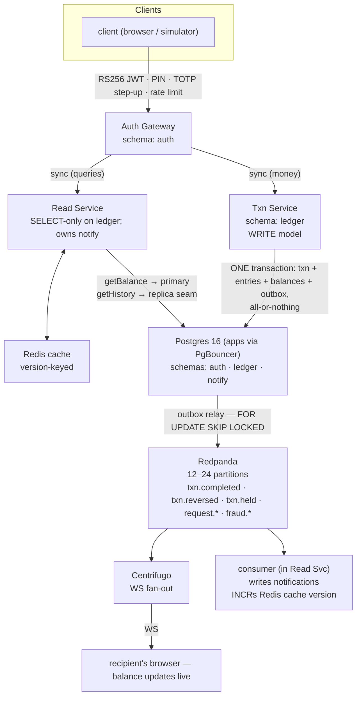
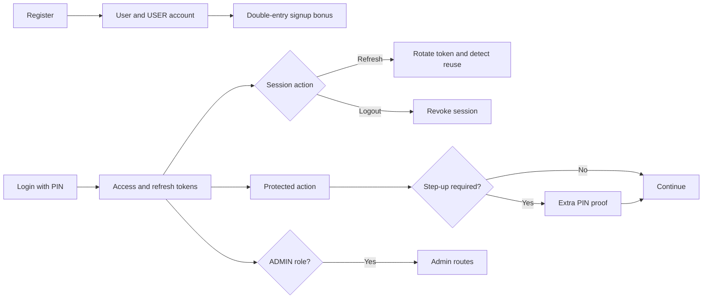
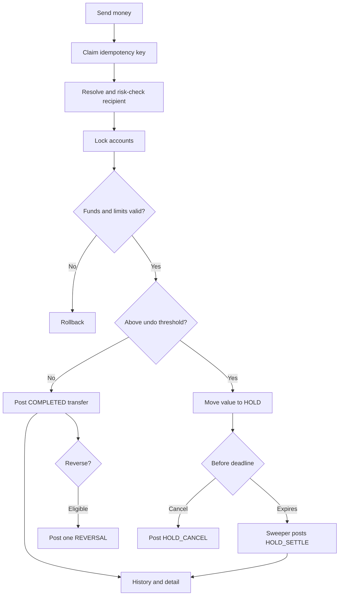
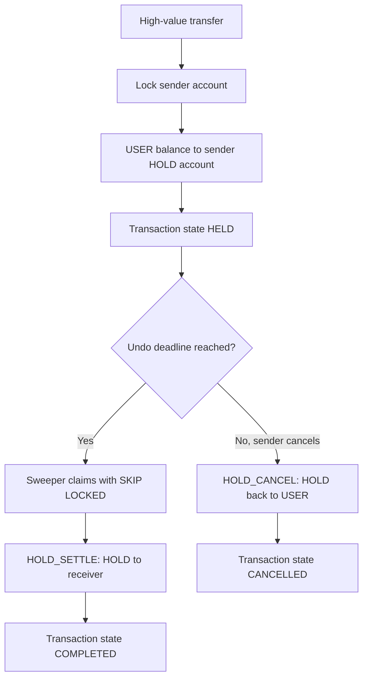
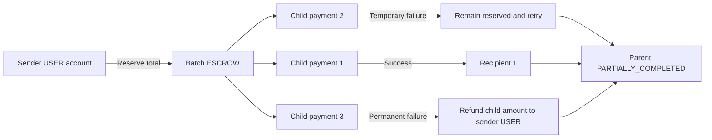
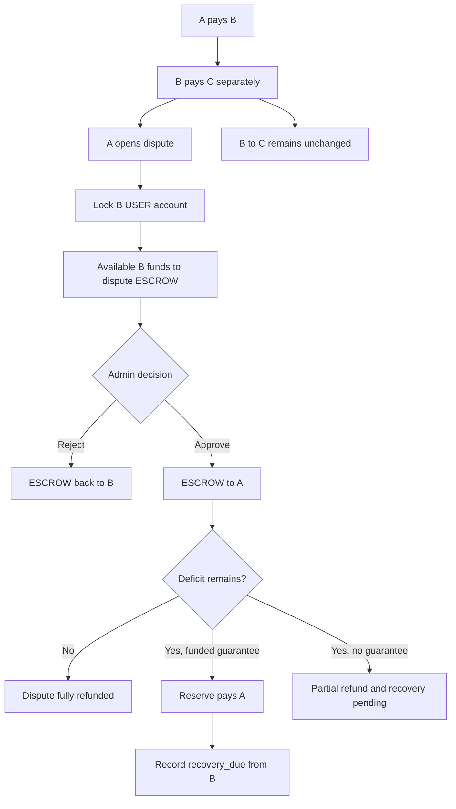
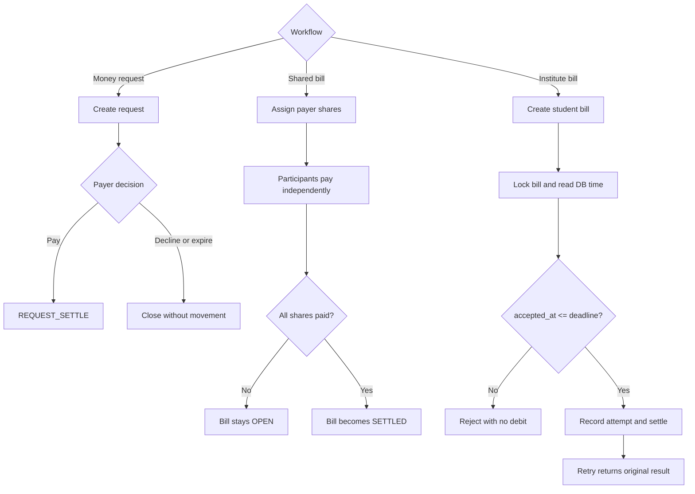
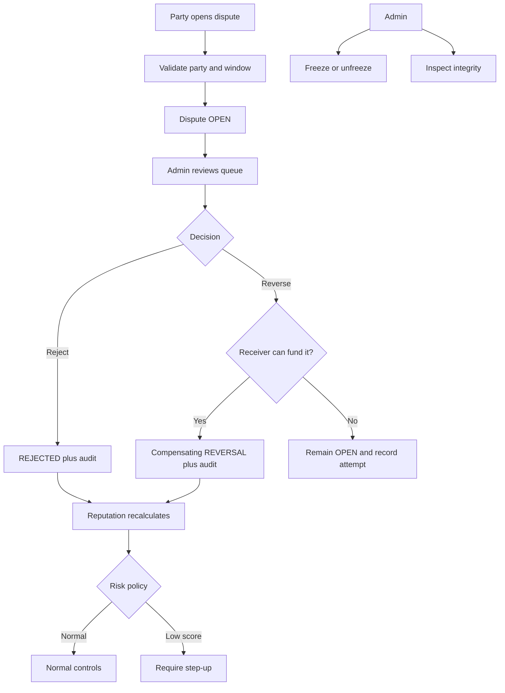
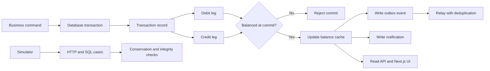
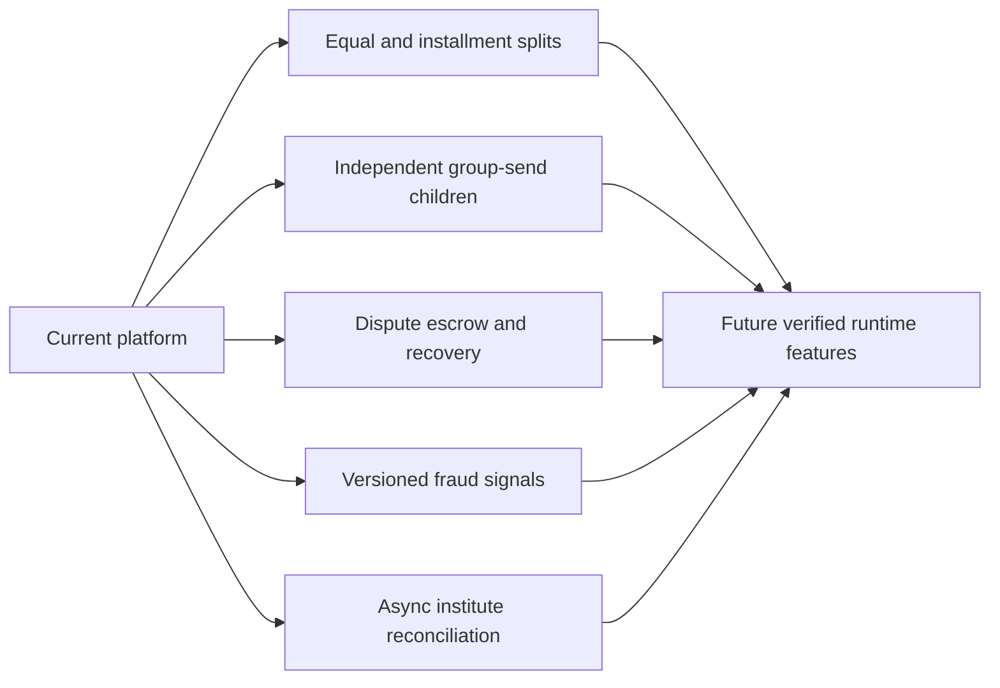

# PSTU Hackathon — Money Movement App

A closed-ecosystem digital money platform: register, get a ৳100,000
signup bonus, send/request money, split bills, dispute a bad transfer,
and see the double-entry ledger that makes every one of those honest.
Built for the PSTU Hackathon (29 Aug 2026, 09:00–15:00) — see
`question/PSTU_Hackathon_Problem_Statement.md` for the original brief.

## What's actually running

One NestJS app (`apps/api`) against Postgres 16, behind Docker infra for
PgBouncer/Redis/Redpanda/Centrifugo. The system was **originally planned
as three services** (Auth Gateway / Txn Service / Read Service — see
`PLAN.md`) and was deliberately collapsed into one deployable mid-contest
once the eval criteria turned out to reward feature depth over service
count. The three-role least-privilege boundary from that original design
is still real, not simulated: `auth_svc`, `txn_svc`, and `read_svc` are
three separate Postgres roles with distinct grants, and the app holds
three separate connection pools (`AUTH_POOL`/`LEDGER_POOL`/`READ_POOL`) —
each module only ever touches its own pool, so splitting back into
separate processes later is "swap a DI provider for an HTTP call," not a
rewrite. Full reasoning: `BUILD_LOG_CLAUDE.md`'s "Pivot" entry.

### Architecture diagram (from `PLAN.md` §1)



The diagram is the *target architecture* from `PLAN.md` §1. What runs today
is the same thing collapsed into one process: the boxes on the left half are
`AuthModule` / `LedgerModule` / `QueryModule` / `NotificationsModule` in one
Nest app, and the Redpanda/Centrifugo side of the diagram is the future
outbox relay + WS bridge (see `KAFKA_WS_DEPLOYMENT_SEAMS.md`).

## Why it's built this way

The core engineering bet, everywhere: **money is a fact recorded twice,
never a number that gets edited.** `ledger.entries` is append-only —
enforced by a Postgres `REVOKE`, not application discipline, so even a
bug can't quietly rewrite history. Every transfer is exactly two rows
that sum to zero; a reversal is a *new* pair of rows, never an edit to
the old one. `accounts.balance` is a cache kept in sync by triggers; the
entries are the truth, and `ledger.v_conservation`/`v_balance_drift`/
`v_negative_accounts` exist so that truth can be checked by SQL at any
time, not just trusted. Every mutating endpoint takes an
`Idempotency-Key` and claims it *before* doing anything else, so the one
frontend bug every payments app eventually ships — the double-tap — turns
into a replay, not a double debit.

## Features

Status labels: **Implemented** means available through the currently wired
API; **built, wiring pending** means the code and tests exist but the module
still needs to be added to `AppModule`; **designed** means future work only.

### Identity and access

| Feature | Status | Short description |
|---|---|---|
| Registration and signup bonus | Implemented | Creates the user and USER account, then posts the ৳100,000 bonus as a real double-entry transaction. |
| Login and JWT authentication | Implemented | PIN login issues short-lived access and refresh tokens for protected routes. |
| Refresh-token rotation | Implemented | Consumes refresh tokens once, rotates their family, and detects replay of stolen old tokens. |
| Logout and logout-all | Implemented | Revokes one refresh session or every session owned by the user. |
| PIN change | Implemented | Changes the authenticated user's PIN through a protected flow. |
| Step-up authentication | Implemented | Requires extra PIN proof for first-time recipients, high values, low-reputation recipients, reversals, and sensitive admin actions. |
| User lookup | Implemented | Resolves a phone number to a privacy-reduced identity, first-time flag, and reputation tier before payment. |
| Admin roles | Implemented | Separates USER and ADMIN permissions with fresh database-backed role checks. |
| WebSocket token | Implemented scaffold | Issues a short-lived token for realtime infrastructure; complete client event delivery remains infrastructure-dependent. |



### Accounts and money movement

| Feature | Status | Short description |
|---|---|---|
| Balance view | Implemented | Returns total, held, and available balances for the authenticated user. |
| One-to-one transfer | Implemented | Sends integer-paisa amounts with account locks, balance checks, daily limits, and double-entry posting. |
| Hold and undo window | Implemented | High-value transfers enter a sender-owned HOLD account and are cancelled by the user or settled by the sweeper. |
| Idempotent commands | Implemented | Actor-scoped keys and request hashes turn retries and double taps into replayed responses instead of duplicate debits. |
w| Concurrency protection | Implemented | Stable lock ordering, row locks, conditional transitions, and unique constraints prevent double spend and double resolution. |
| Transaction history | Implemented | Lists sent and received transactions with direction, kind, state, counterparty, filters, and cursor pagination. |
| Transaction detail | Implemented | Shows transaction facts, counterparty, ledger legs, hold/reversal information, and reversal eligibility. |
| User reversal | Implemented | Creates exactly one compensating `REVERSAL` instead of editing the original ledger history. |
| Daily limits | Implemented | Calculates spent and remaining allowance using the Dhaka day boundary and database-backed overrides. |



### Escrow-related flows

Escrow separates money that is temporarily unavailable from a user's spendable
balance. The undo HOLD flow is implemented; batch-payment escrow and dispute-
recovery escrow are designed extensions.

| Escrow flow | Status | Purpose |
|---|---|---|
| Transfer HOLD | Implemented | Temporarily holds a high-value transfer until the sender cancels it or the undo window expires. |
| Group-payment escrow | Designed | Reserves one sender total while independent recipient payments succeed, retry, or refund. |
| Dispute escrow | Designed | Secures the receiver's available funds while a dispute is reviewed, without rewriting unrelated transfers. |

#### Transfer HOLD: reserve, cancel, or settle



#### Group-payment escrow: reserve once, resolve children independently



#### Dispute escrow: secure recoverable funds and preserve downstream money



### Requests, bills, and multi-party payments

| Feature | Status | Short description |
|---|---|---|
| Money requests | Implemented | Lets a requester ask one payer, who can pay or decline while the requester can cancel or remind. |
| Request inbox/outbox and expiry | Implemented | Lists incoming/outgoing requests with filters and pagination and lazily expires overdue pending requests. |
| Shared bill creation | Implemented | Creates one bill with several unique payers and creator-defined positive shares. |
| Independent bill-share payment | Implemented | Each payer settles only their stored share; the bill settles when all shares are paid. |
| Shared bill listing/detail | Implemented | Shows bills created or owed and each participant's settlement progress. |
| Shared bill cancellation | Implemented | Lets the creator cancel only before any share has been paid. |
| Institute bill creation | Built, wiring pending | Lets an admin create a student bill for a seeded institute and settlement account. |
| Deadline-based institute payment | Built, wiring pending | Atomically enforces `accepted_at <= deadline`, settles through the normal ledger writer, and safely replays accepted payments after cutoff. |
| Institute bill/attempt history | Built, wiring pending | Lists a student's institute bills and their immutable acceptance and settlement timestamps. |



### Trust, disputes, and administration

| Feature | Status | Short description |
|---|---|---|
| User disputes | Implemented | Allows either transaction party to open one active claim within the configured dispute window. |
| Admin dispute queue | Implemented | Shows parties, transaction facts, receiver balance, attempts, and current reversibility with pagination. |
| Dispute resolution | Implemented | Rejects a claim or posts a compensating reversal with step-up, idempotency, locking, and audit history. |
| Failed-reversal tracking | Implemented | Keeps the claim open and records attempts when the receiver has already spent the funds. |
| Reputation score and tiers | Implemented | Derives a 0–100 signal from account age, completed activity, reversed disputes, and current frozen status. |
| Reputation-aware payment | Implemented | Uses low reputation as a reason for step-up, not automatic proof of fraud. |
| Account freeze/unfreeze | Implemented | Lets a step-up-authenticated admin restrict or restore sending with a recorded reason. |
| Admin reputation view | Implemented | Exposes the score and contributing aggregates to authorized administrators. |
| Integrity dashboard | Implemented | Reports conservation, balance drift, negative accounts, unbalanced transactions, and outbox health. |
| Audit log | Implemented | Records sensitive actors, actions, entities, before/after values, and reasons. |



### Notifications, ledger safety, frontend, and verification

| Feature | Status | Short description |
|---|---|---|
| In-app notifications | Implemented | Writes transfer, request, bill-share, hold-settlement, and reversal notifications in the money transaction. |
| Notification inbox | Implemented | Lists notifications with pagination and marks one or all as read. |
| Double-entry ledger | Implemented | Writes balanced debit/credit legs and rejects incomplete or unbalanced transactions at commit. |
| Append-only entries | Implemented | Database permissions prevent the transaction role from updating or deleting ledger history. |
| Balance reconciliation | Implemented | Compares cached balances with ledger-derived balances and exposes controlled repair tooling. |
| Non-negative accounts | Implemented | Prevents USER, HOLD, and ESCROW balances from falling below zero. |
| Transactional outbox | Implemented | Commits durable integration events beside ledger changes so post-commit crashes cannot lose events. |
| Event deduplication | Implemented schema | Records processed event IDs so at-least-once delivery cannot duplicate downstream work. |
| Monthly ledger partitions | Implemented | Partitions entries by month and safely creates future partitions with integrity triggers. |
| Least-privilege DB roles | Implemented | Uses separate auth, transaction, and read roles/pools with different grants. |
| Scenario simulator | Implemented | Runs real HTTP/SQL cases and checks conservation, drift, negative balances, and balanced transactions after every scenario. |
| Next.js UI | Implemented frontend track | Provides dashboard, send, history/detail, requests, bills, disputes, limits, admin disputes, and integrity screens. |



### Designed extensions, not current runtime features

| Feature | Status | Short description |
|---|---|---|
| Equal and installment bill splitting | Designed | Deterministically allocates equal-share remainders and permits safe partial payment within a share. |
| Send money to a group | Designed | Uses a parent batch, independent children, reservation, retry, and per-recipient refunds. |
| Dispute escrow and recovery debt | Designed | Secures available funds, preserves unrelated transfers, and records a funded-refund deficit for recovery. |
| Rich fraud-signal reputation | Designed | Adds immutable signals, confidence, decay, correlation caps, versioning, graduated actions, and appeals. |
| Async institute settlement | Designed | Adds callbacks, bounded retry, reconciliation, time-zone display, and optional installment obligations. |



## Repo map

| Path | What it is |
|---|---|
| `apps/api` | The NestJS monolith — everything runs here |
| `packages/shared` | Errors, the `pg` pool factory (BIGINT type-parser fix included), SQL helpers used by every module |
| `sim` | The scenario simulator — see below |
| `frontend` | A separate Next.js app/track, not covered by this backend work |
| `SCHEMA.sql` + `infra/sql/*.sql` | The full schema, applied in order by `scripts/apply-schema.js` |
| `PLAN.md` | Original architecture/schedule design (see its status banner) |
| `API.md` | Every endpoint, request/response shape, error code |
| `UI_SPEC.md` | Every screen, state, and interaction (Stitch mocks referenced by screen id) |
| `SIMULATOR.md` | The scenario harness spec |
| `EXTRA_FEATURES_AUDIT_AND_DESIGN.md` | Gap analysis against the actual scoring rubric |
| `KAFKA_WS_DEPLOYMENT_SEAMS.md` | How the current code is already separated (3 DB roles/pools, outbox, notify, Centrifugo token) so a Kafka/WebSocket split is a deploy change, not a rewrite |
| `TASKS_CLAUDE.md` / `TASKS_CODEX.md` / `TASKS_ANTIGRAVITY.md` / `TASKS_DEEPSEEK.md` | Multi-agent coordination — current status and assignments |
| `BUILD_LOG_CLAUDE.md`, `BUILD_LOG_ANTIGRAVITY.md`, `BUILD_LOG_DEEPSEEK.md` | Running narrative logs, newest entry on top |

## Running it

Infra is always Docker; the app runs locally against it.

```bash
npm install
npm run infra:up          # Postgres, PgBouncer, Redis, Redpanda, Centrifugo
npm run db:apply          # SCHEMA.sql + every infra/sql/*.sql amendment, in order (each file runs once ever)
npm run dev                # apps/api, npm run start:dev, hot-reload
npm run sim                # the scenario simulator, needs the app up
```

`apps/api/.env.example` documents every environment variable and *why* it
exists (signup bonus amount, step-up thresholds, the undo window, the
dispute window, the reputation threshold) — copy it to `apps/api/.env`
before the first run.

A `justfile` wraps all of the above plus the ad-hoc verification scripts
(`just --list` to see every recipe) if you have [`just`](https://just.systems)
installed — `just bootstrap` is infra-up + db-apply in one shot,
`just sim-tag disputes` runs one scenario group, `just promote-admin 3`
flips a user to `ADMIN` for testing. Nothing in it does anything the `npm`
scripts above don't already do; it's a shorter way to type them.

## Verifying it

The simulator (`sim/`) is the actual proof, not a demo script: it drives
real HTTP against the real API, and after **every** scenario — pass or
fail — it re-checks four invariants that must hold regardless of what the
scenario was testing: global conservation (`v_conservation` is always 0),
zero balance drift, zero negative non-system balances, and every
transaction's legs sum to zero. A scenario never re-checks these itself;
the harness does it for free, so a bug shows up on whichever scenario ran
next, not only the one written to look for it.

```bash
npm run sim                      # everything
npm run sim -- --tag disputes    # one group
npm run sim -- --reset           # clean slate first
```

Coverage as of this round: the full priority-feature set (transfers, HOLD/
undo, reversals, disputes, money requests, shared bills, reputation,
notifications) plus auth/validation edge cases and concurrency races, all
exercised over real HTTP with conservation held throughout. Exact
per-group pass counts move as agents land new scenarios — `TASKS_CLAUDE.md`
carries the current number; treat this README's own claim as directional,
not the source of truth.

## Multi-agent development note

This project was built collaboratively by a human developer plus four AI
coding agents working in parallel against the same repo: **Claude**
(backend + master coordination), **Codex** and **Antigravity** (backend
features, split by file ownership to avoid collisions), and **DeepSeek**
(UI design in Stitch + `UI_SPEC.md`). Coordination artifacts
(`TASKS_*.md`, `BUILD_LOG_*.md`) are kept in the repo root rather than
squashed away — they're the actual record of who built what, why, and
what was verified before being trusted, which is worth being able to
answer directly if asked.
